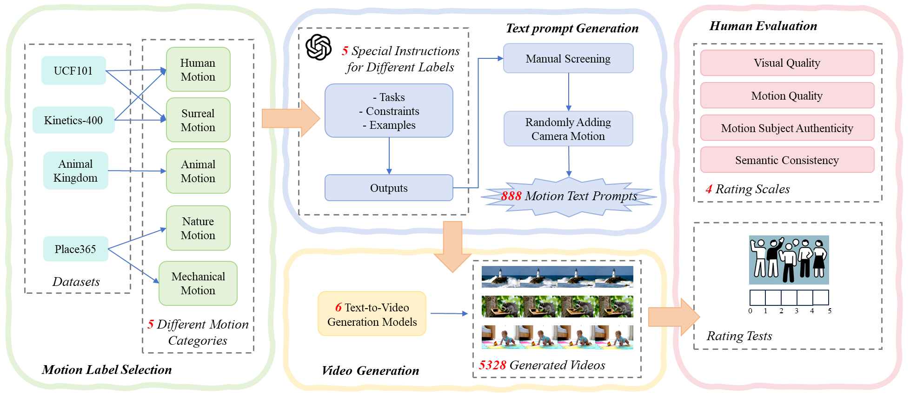

# MoGenVD: A Motion-Centered Quality Assessment Benchmark for Text-to-Video Generation

This repository provides the official release page for **MoGenVD**, a motion-centered quality assessment benchmark for text-to-video (T2V) generation.

MoGenVD is designed to support the evaluation and analysis of generated videos from a motion-centric perspective. It emphasizes motion-related quality characteristics through motion-centered prompt design and fine-grained subjective quality annotation.

## Dataset Download

The complete MoGenVD dataset can be downloaded from the following links:

- Google Drive: [Download link](https://drive.google.com/file/d/1sySOn7Ywz_V0LOh0J7dEK-j8_Vj6CwyF/view?usp=sharing)
- Baidu Netdisk: [Download link](https://pan.baidu.com/s/1AwKrwLunVjYLUns-kEX_Nw?pwd=e9t3)  (Extraction code: `e9t3`)

The dataset package includes generated videos, MOS annotations, prompt information, and dataset description files.

## Overview

MoGenVD contains:

- **888** motion-focused text prompts, organized into **five motion categories are designed**;
- **5,328** videos generated by **six representative text-to-video models**;
- subjective annotations from **91 valid participants** (up to 29 for each video);
- subjective quality annotations under **four dimensions**:
  - visual quality;
  - motion quality;
  - motion subject authenticity;
  - semantic consistency.

The dataset aims to facilitate research on motion-aware and text-aware video quality assessment for AI-generated videos.
The construction pipeline is shown below.



## Motion Categories

The 888 text prompts are organized into five motion categories:

| Motion Category | Number of Prompts |
|---|---:|
| Human motion | 292 |
| Animal motion | 189 |
| Mechanical motion | 111 |
| Nature motion | 198 |
| Surreal motion | 98 |
| **Total** | **888** |

To enrich diversity, a subset of prompts is further augmented with camera motion descriptions, such as zoom-in, zoom-out, pan-left, pan-right, tilt-up, and tilt-down.

## Text-to-Video Generation Models

The videos in MoGenVD are generated using six representative T2V models:

| Model | Resolution | Frame Rate | Frame Count |
|---|---:|---:|---:|
| AnimateDiff | 512 × 512 | 8 fps | 16 |
| VideoCrafter2 | 512 × 320 | 8 fps | 16 |
| LaVie | 512 × 320 | 8 fps | 16 |
| CogVideoX-5b | 720 × 480 | 8 fps | 17 |
| Wan-AI-1.3b | 832 × 480 | 12 fps | 25 |
| MAGI-1 | 896 × 512 | 8 fps | 16 |

All videos are generated using the official implementations of the corresponding models with their default inference configurations.

## Subjective Annotation Dimensions

Each generated video is evaluated using four subjective quality dimensions:

| Dimension | Description |
|---|---|
| Visual Quality | Overall perceptual quality of the generated video, including visual fidelity and visible artifacts. |
| Motion Quality | Temporal smoothness, motion continuity, physical plausibility, and naturalness of the generated motion. |
| Motion Subject Authenticity | Structural authenticity of the moving subject, including plausible proportions, limb or organ consistency, spatial integrity, and the absence of unrealistic deformation. |
| Semantic Consistency | Alignment between the generated video and the input text prompt, including subject identity, action, scene, and camera motion when specified. |


## Current Release Status

The repository is currently under preparation.

- [x] Dataset description
- [x] Text prompts
- [x] Generated videos
- [x] MOS annotations

## Citation

If you use MoGenVD in your research, please kindly cite our paper:

```bibtex
@article{zhang2026mogenvd,
  title   = {MoGenVD: A Motion-Centered Quality Assessment Benchmark for Text-to-Video Generation},
  author  = {Zhang, Yingxue and Yang, Zike and Su, Zihang and Hu, Yaosi and Chen, Chang Wen},
  journal = {IEEE Transactions on Circuits and Systems for Video Technology},
  year    = {2026}
}
```

The BibTeX entry will be updated after the final publication information is available.

## License

The MoGenVD dataset is released for academic research purposes only.

The dataset will be released under the Creative Commons Attribution-NonCommercial 4.0 International License (CC BY-NC 4.0), unless otherwise specified.

Users are allowed to use, share, and adapt the dataset for non-commercial research purposes, provided that the original paper is properly cited.

Commercial use, redistribution for commercial purposes, or use in commercial products is not permitted without explicit permission from the authors.

Users are responsible for ensuring that their use of the dataset complies with the licenses and terms of the corresponding source models.

## Contact

For any questions about the dataset, please feel free to contact yxzhang@tust.edu.cn.

## Acknowledgement

We thank all participants involved in the subjective quality assessment experiment.
